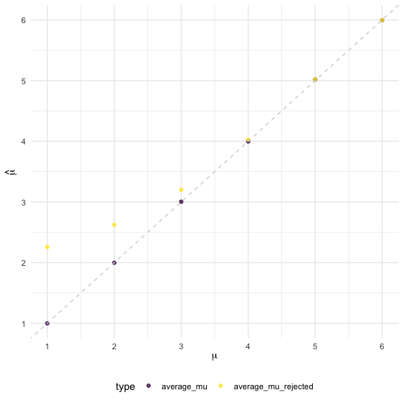

p8015_hw5_yl5839
================
Yuying Lu
2024-11-13

``` r
library(tidyverse)

theme_set(theme(legend.position = "bottom"))

options(
  ggplot2.continuous.colour = "viridis",
  ggplot2.continuous.fill = "viridis"
)

scale_colour_discrete = scale_colour_viridis_d
scale_fill_discrete = scale_fill_viridis_d
```

# Problem 1

## Set function

``` r
birth_share = function(group_size){
  birth_select = sample(1:365,group_size,replace=TRUE)
  return(length(unique(birth_select))<group_size)
}
```

Running this function for 10000 times for each group size between 2 and
50, calculate the probability of birthday sharing and make the plot.

``` r
set.seed(1)

sim_results_df = 
  expand_grid(
    group_size = 2:50,
    iter = 1:10000
  ) |> 
  mutate(
    birth_share = map(group_size, birth_share)
  ) |> 
  unnest(birth_share) |> 
  group_by(group_size) |> 
  summarise(probability = mean(birth_share))

sim_results_df |>
  mutate(
    group_size = str_c(group_size),
    group_size = fct_inorder(group_size)) |> 
  ggplot(aes(x = group_size, y = probability))+
  geom_point()+
  geom_line()
```

<!-- -->

**Comment:** According to the picture based on the 10000 times
simulation, we can see the probability that at least two people in the
group will share a birthday increases as the group size increases. And
the probability will converges to 1 when the group size is large.

# Problem 2

Generate 5000 datasets, each with $n=30$ samples from
$N(\mu=0,\sigma=5)$ and or each data set, calculate the sample mean
$\hat{\mu}$ and p-value of the hypothesis test with $\alpha = 0.05$.

``` r
set.seed(2)
norm_df = 
  expand_grid(
    mu_true = 0,
    iter = 1:5000
  ) |> 
  mutate(
    norm_sample = map(mu_true, \(mu) rnorm(n = 30, mean = mu, sd = 5))
  ) |> 
  mutate(
  test_result = map(norm_sample, \(df) broom::tidy(t.test(df, mu = 0)))
) |> 
  unnest(test_result) |> 
  select(mu_true, iter, estimate, p.value)

norm_df 
```

    ## # A tibble: 5,000 × 4
    ##    mu_true  iter estimate p.value
    ##      <dbl> <int>    <dbl>   <dbl>
    ##  1       0     1    1.14    0.295
    ##  2       0     2   -0.175   0.868
    ##  3       0     3   -1.23    0.226
    ##  4       0     4    0.901   0.381
    ##  5       0     5    0.337   0.735
    ##  6       0     6   -0.180   0.845
    ##  7       0     7   -0.464   0.587
    ##  8       0     8    0.495   0.634
    ##  9       0     9    0.865   0.320
    ## 10       0    10    0.666   0.526
    ## # ℹ 4,990 more rows

The column named `estimate` represents $\hat{\mu}$.

Then repeat the above process for $\mu = \{1,2,3,4,5,6\}$:

``` r
set.seed(3)
new_norm_df = 
  expand_grid(
    mu_true = 1:6,
    iter = 1:5000
  ) |> 
  mutate(
    norm_sample = map(mu_true, \(mu) rnorm(n = 30, mean = mu, sd = 5))
  ) |> 
  mutate(
  test_result = map(norm_sample, \(df) broom::tidy(t.test(df, mu = 0)))
) |> 
  unnest(test_result) |> 
  select(mu_true, iter, estimate, p.value)
```

Next we plot the proportion of times the null was rejected

``` r
new_norm_df |> 
  mutate(reject = p.value < 0.05) |> 
  group_by(mu_true) |> 
  summarise(reject_proportion = mean(reject)) |> 
  ggplot(aes(x = mu_true, y = reject_proportion)) +
  geom_point() +
  geom_line() +
  theme_minimal(base_size = 15) +
  xlab(expression(mu)) +
  scale_x_continuous(breaks = 1:6)
```

<!-- -->

**Association:** When $\mu \in \{1,...,6\}$, a larger $\mu$ has a higher
reject proportion and it converges to 1.

Showing average $\hat{\mu}$ and the average $\hat{\mu}$ when null was
rejected. v.s. true $\mu$

``` r
new_norm_df |> 
  mutate(reject_mu = ifelse(p.value < 0.05, estimate, NA)) |> 
  group_by(mu_true) |> 
  summarise(average_mu = mean(estimate),
            average_mu_rejected = mean(reject_mu,na.rm = TRUE)) |> 
  pivot_longer(
    average_mu:average_mu_rejected,
    names_to = "type",
    values_to = "hat_mu"
  ) |> 
  ggplot(aes(x = mu_true, y = hat_mu, color = type))+
  geom_point(alpha = 0.75) +
  geom_abline(linetype = "dashed", size = .5, color = 'lightgrey') +
  theme_minimal() +
  xlab(expression(mu)) +
  ylab(expression(hat(mu))) +
  scale_x_continuous(breaks = 1:6) +
  scale_y_continuous(breaks = 1:6) +
  theme(legend.position = "bottom")
```

<!-- -->

From the plot, the sample average of $\hat{\mu}$ across tests for which
the null is rejected isn’t approximately equal to the true value of
$\mu$, when the true $\mu$ is close to $0$. The reason is when
calculating the average of the estimate $\hat{\mu}$ in the sample that
the null was rejected (we call it `average_mu_rejected`), we actually
excluded the estimate $\hat{\mu}$ that is approximate to 0. By the Law
of Large Number theorem, the average of all the estimates $\hat{\mu}$
(we call it `average_mu`) converges to the true $\mu$. However, when we
exclude the estimates close to 0, the rest average increases, leading to
a estimating bias. Additionally, when the true $\mu$ is close to 0,
excluding the estimate that was rejected can result in a more
significant deviation of the `average_mu_rejected` from the true $\mu$.
This exclusion creates a larger bias, as illustrated in the figure.

# Problem 3

``` r
url = "https://raw.githubusercontent.com/washingtonpost/data-homicides/master/homicide-data.csv"
homi_df = read_csv(url)
homi_df
```

    ## # A tibble: 52,179 × 12
    ##    uid        reported_date victim_last  victim_first victim_race victim_age
    ##    <chr>              <dbl> <chr>        <chr>        <chr>       <chr>     
    ##  1 Alb-000001      20100504 GARCIA       JUAN         Hispanic    78        
    ##  2 Alb-000002      20100216 MONTOYA      CAMERON      Hispanic    17        
    ##  3 Alb-000003      20100601 SATTERFIELD  VIVIANA      White       15        
    ##  4 Alb-000004      20100101 MENDIOLA     CARLOS       Hispanic    32        
    ##  5 Alb-000005      20100102 MULA         VIVIAN       White       72        
    ##  6 Alb-000006      20100126 BOOK         GERALDINE    White       91        
    ##  7 Alb-000007      20100127 MALDONADO    DAVID        Hispanic    52        
    ##  8 Alb-000008      20100127 MALDONADO    CONNIE       Hispanic    52        
    ##  9 Alb-000009      20100130 MARTIN-LEYVA GUSTAVO      White       56        
    ## 10 Alb-000010      20100210 HERRERA      ISRAEL       Hispanic    43        
    ## # ℹ 52,169 more rows
    ## # ℹ 6 more variables: victim_sex <chr>, city <chr>, state <chr>, lat <dbl>,
    ## #   lon <dbl>, disposition <chr>

The raw data gathers homicides in 50 larges U.S. cities, containing
52179 rows and 12 columns. Each row represents a case of homicide
including its uid, reported date, information of the victim (first and
last name, race, age, sex), city and state where the homicide took
place, the latitude and longitude of this place, and the disposition of
this case.

### Data Wrangling

``` r
summary_df = 
  homi_df |> 
  mutate(city_state = paste0(city, ', ', state)) |> 
  group_by(city_state) |> 
  summarise(
    total_num = n(),
    unsolved_num = sum(disposition %in% c("Closed without arrest", "Open/No arrest"))
  )
summary_df
```

    ## # A tibble: 51 × 3
    ##    city_state      total_num unsolved_num
    ##    <chr>               <int>        <int>
    ##  1 Albuquerque, NM       378          146
    ##  2 Atlanta, GA           973          373
    ##  3 Baltimore, MD        2827         1825
    ##  4 Baton Rouge, LA       424          196
    ##  5 Birmingham, AL        800          347
    ##  6 Boston, MA            614          310
    ##  7 Buffalo, NY           521          319
    ##  8 Charlotte, NC         687          206
    ##  9 Chicago, IL          5535         4073
    ## 10 Cincinnati, OH        694          309
    ## # ℹ 41 more rows

### `prop,test` for city of Baltimore, MD

``` r
baltimore_df = 
  summary_df |> 
  filter(city_state == "Baltimore, MD") 

prop_test_output = 
  prop.test(baltimore_df$unsolved_num, baltimore_df$total_num)

tidy_df = 
  prop_test_output |> 
  broom::tidy() 

tidy_df |> 
  select(estimate, conf.low, conf.high)
```

    ## # A tibble: 1 × 3
    ##   estimate conf.low conf.high
    ##      <dbl>    <dbl>     <dbl>
    ## 1    0.646    0.628     0.663

The estimate proportion of unsolved homicides is 0.6455607, and its
confidence interval is \[0.6275625, 0.6631599\].

### `prop,test` for all cities

``` r
prop_test_all = 
  summary_df |> 
  mutate(
    prop_test = map2(unsolved_num, total_num, \(un_n, n) prop.test(un_n, n)),
    prop_test = map(prop_test, broom::tidy)
    ) |> 
  unnest(prop_test) 

prop_test_all
```

    ## # A tibble: 51 × 11
    ##    city_state      total_num unsolved_num estimate statistic   p.value parameter
    ##    <chr>               <int>        <int>    <dbl>     <dbl>     <dbl>     <int>
    ##  1 Albuquerque, NM       378          146    0.386   19.1    1.23e-  5         1
    ##  2 Atlanta, GA           973          373    0.383   52.5    4.32e- 13         1
    ##  3 Baltimore, MD        2827         1825    0.646  239.     6.46e- 54         1
    ##  4 Baton Rouge, LA       424          196    0.462    2.27   1.32e-  1         1
    ##  5 Birmingham, AL        800          347    0.434   13.8    2.05e-  4         1
    ##  6 Boston, MA            614          310    0.505    0.0407 8.40e-  1         1
    ##  7 Buffalo, NY           521          319    0.612   25.8    3.73e-  7         1
    ##  8 Charlotte, NC         687          206    0.300  109.     1.41e- 25         1
    ##  9 Chicago, IL          5535         4073    0.736 1231.     1.28e-269         1
    ## 10 Cincinnati, OH        694          309    0.445    8.11   4.41e-  3         1
    ## # ℹ 41 more rows
    ## # ℹ 4 more variables: conf.low <dbl>, conf.high <dbl>, method <chr>,
    ## #   alternative <chr>

``` r
prop_test_all|> 
  mutate(
    CI = paste0("[", round(conf.low,4),", ",round(conf.high,4),"]"),
    estimate = round(estimate,4)
  ) |> 
  select(city_state, estimate, CI)
```

    ## # A tibble: 51 × 3
    ##    city_state      estimate CI              
    ##    <chr>              <dbl> <chr>           
    ##  1 Albuquerque, NM    0.386 [0.3373, 0.4376]
    ##  2 Atlanta, GA        0.383 [0.3528, 0.4148]
    ##  3 Baltimore, MD      0.646 [0.6276, 0.6632]
    ##  4 Baton Rouge, LA    0.462 [0.4142, 0.511] 
    ##  5 Birmingham, AL     0.434 [0.3992, 0.469] 
    ##  6 Boston, MA         0.505 [0.4646, 0.5451]
    ##  7 Buffalo, NY        0.612 [0.5688, 0.6541]
    ##  8 Charlotte, NC      0.300 [0.2661, 0.3359]
    ##  9 Chicago, IL        0.736 [0.724, 0.7474] 
    ## 10 Cincinnati, OH     0.445 [0.408, 0.4831] 
    ## # ℹ 41 more rows

Make the plot for the prop.test result:

``` r
prop_test_all |> 
  ggplot(aes(x = reorder(city_state, estimate), y = estimate)) +
  geom_point(size = 2, color = "#DF6604") +
  geom_errorbar(aes(ymin = conf.low, ymax = conf.high), width = 0.3, color = "darkgray", size = 0.8) +
  coord_flip() +
  labs(
    title = "Proportion of Unsolved Homicides by City",
    x = "City",
    y = "Proportion of Unsolved Homicides"
  ) +
  theme_minimal() + 
  theme(
    plot.title = element_text(hjust = 0.5, face = "bold", size = 18),  
    axis.title.x = element_text(size = 14, face = "bold"),  
    axis.title.y = element_text(size = 14, face = "bold"),  
    axis.text.x = element_text(size = 12, color = "black"), 
    axis.text.y = element_text(size = 12, color = "black"), 
    panel.grid.major = element_line(color = "lightgray", size = 0.5),  
    panel.grid.minor = element_blank()  
  ) +
  scale_y_continuous(labels = scales::percent_format(accuracy = 1))  
```

<!-- -->
